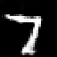
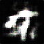

# DCGAN Custom Architecture Builder and Synthetic Image Generator

This project is a DCGAN (Deep Convolutional Generative Adversarial Network) custom architecture builder and image synthesizer. It allows the user to specify the architecture of the generator and discriminator, visualize the models, train the GAN, and synthesize images. This allows for dynamic experimentation with the architecture of the generator and discriminator because as detailed in the literature [1] and [2] the architecture of the generator and discriminator impacts the performance of the GAN.  

The user interface is built in Python using Tkinter, and the models are built using TensorFlow and Keras the diagrams are visualized with visualkeras and tensorflow keras utils.  


## Project Setup

Currently, the project is a single python file, and the dependencies are:

```sh
pip install numpy matplotlib tensorflow keras visualkeras pillow pydot
```

## Project Execution

```sh
python main.py
```

## Ground Truth MNIST Sevens

We will be using the MNIST dataset of handwritten digits, for training open character recognition models. We specifically use the sevens for initial experimentation.  

Ten of the 4401 MNIST sevens train data images are shown below.  


## First Experiment

We trained the custom DCGAN model on the MNIST 7's train data for 10 epochs with loss values of batch=1300, d_loss=1.2257, g_loss=0.9160, and generated 5 images.  


## Second Experiment

We trained the custom DCGAN model on the MNIST 7's train data for 30 epochs with loss values of batch=4100, d_loss=0.9101, g_loss=1.2164, and generated 6 images.  

This is the first experiment with custom architecture parameters.  

Experiment architecture parameters:  
Training data: MNIST train set digit sevens.  
Epochs: 30  
Latent Dim: 100  
Generator: 1024,4,1; 512,5,2; 256,5,2; 128,5,2; 3,5,2  
Discriminator: 64,4,2; 128,4,2; 256,4,2; 512,4,2  
Resultant loss values: batch=4100, d_loss=0.9101, g_loss=1.2164  


### Architecture Block Diagrams for the Second Experiment

#### Second Experiment Generator Block Diagram


#### Second Experiment Discriminator Block Diagram


## Third Experiment

We trained the custom DCGAN model on the MNIST 7's train data for 10 epochs with loss values of batch=1300, d_loss=1.3237, g_loss=0.7212, and generated 10 images.  

Using the following architecture parameters:
Generator: 1024,4,1; 512,4,2; 256,4,2; 128,4,2; 3,4,2
Discriminator: 64,4,2; 128,4,2; 256,4,2; 512,4,2

This is the first experiment with dynamic starting spatial dimensions allowing for this architecture to be used for any image size.





### Architecture Block Diagrams for the Third Experiment

#### Third Experiment Generator Block Diagram


#### Third Experiment Discriminator Block Diagram


## Fourth Experiment

This is the first experiment with grayscale image input, previously the images were processed as RGB.  

2 epochs of training with the following loss values:
Not grayscale batch=200, d_loss=1.3812, g_loss=0.7681
Grayscale batch=200, d_loss=1.3975, g_loss=0.7304

Architecture parameters:
Generator: 1024,4,1; 512,4,2; 256,4,2; 128,4,2; 3,4,2
Discriminator: 64,4,2; 128,4,2; 256,4,2; 512,4,2

Latent dimension: 100
Generated images: 12

Processed as RGB:  





Processed as grayscale:  


## Todo

- [ ] Add graph visualization of the generator and discriminator loss values over training epochs.

## Referenced Citations

[1] Radford, A. (2015). Unsupervised representation learning with deep convolutional generative adversarial networks. arXiv preprint arXiv:1511.06434.

[2] S. Vijaya Lakshmi, Vallik Sai Ganesh Raju Ganaraju, “Deep Convolutional Generative Adversial Network on
MNIST Dataset”, Journal of Science and Technology, Vol. 06, Issue 03, May-June 2021, pp169-177

## License

This project is licensed under the MIT License - see the [LICENSE](LICENSE) file for details.
