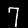
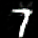

# DCGAN Custom Architecture Builder and Synthetic Image Generator

This project is a DCGAN (Deep Convolutional Generative Adversarial Network) custom architecture builder and image synthesizer.  
It allows the user to specify the architecture of the generator and discriminator, visualize the models, train the GAN, and synthesize images.  

The user interface is built in Python using Tkinter, and the models are built using TensorFlow and Keras the diagrams are visualized with visualkeras and tensorflow keras utils.

We will be using the MNIST dataset of handwritten digits, specifically the sevens for experimentation.  

## Ground Truth MNIST Sevens

Ten of the 4401 MNIST sevens train data images are shown below.

## First Experiment

We trained the custom DCGAN model on the MNIST 7's train data for 10 epochs with loss values of batch=1300, d_loss=1.2257, g_loss=0.9160, and generated 5 images.

## Second Experiment

Training data: MNIST train set digit sevens.  
Epochs: 30  
Latent Dim: 100  
Generator: 1024,4,1; 512,5,2; 256,5,2; 128,5,2; 3,5,2  
Discriminator: 64,4,2; 128,4,2; 256,4,2; 512,4,2  
Resultant loss values: batch=4100, d_loss=0.9101, g_loss=1.2164  

### Architecture Block Diagrams

#### Generator

#### Discriminator

## Referenced Citations

- Radford, A. (2015). Unsupervised representation learning with deep convolutional generative adversarial networks. arXiv preprint arXiv:1511.06434.

- S. Vijaya Lakshmi, Vallik Sai Ganesh Raju Ganaraju, “Deep Convolutional Generative Adversial Network on
MNIST Dataset”, Journal of Science and Technology, Vol. 06, Issue 03, May-June 2021, pp169-177

## License

This project is licensed under the MIT License - see the [LICENSE](LICENSE) file for details.
